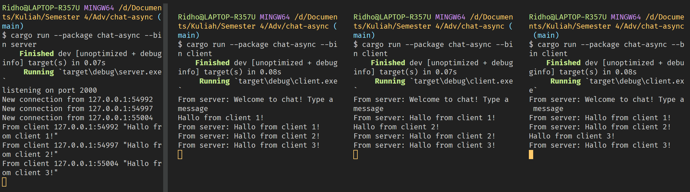
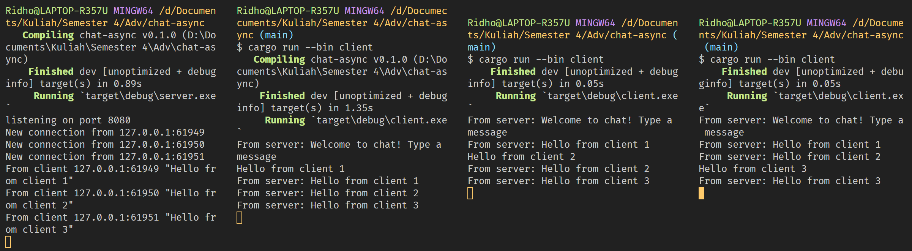

# Tutorial for Advance Programming Course 2023/2024

**Nama** : **Restu Ahmad Ar Ridho** <br/>
**NPM** : **2206028951** <br/>
**Kelas** : **Advance Programming - A**

## Module 10 - Asynchoronous Programming - Chat Async

#### Experiment 2.1: Original code, and how it run

Seperti yang terlihat dari hasil output di atas, setelah server dijalankan menggunakan perintah `cargo run --bin server` dan tiap-tiap klien dijalankan dengan perintah `cargo run --bin client`, masing-masing klien dan server menerima pesan yang disiarkan dari klien lainnya. Setiap kali suatu klien mengetikkan pesan di baris perintah, pesan tersebut dikirimkan ke server, yang kemudian menyebarkannya ke semua klien yang terhubung. Dengan demikian, semua klien dapat melihat pesan-pesan yang dikirim oleh klien lainnya secara real-time.

#### Experiment 2.2: Modifying port

Ketika kita menggubah port pada sisi client dari `2000` menjadi `8080` maka kita juga perlu mengubah port pada sisi server. Hal ini terjadi karena pada sisi client butuh menghubungkan koneksi sesuai dengan dimana url sisi server dijalankan. Oleh karena itu, sisi server juga diubah pada fungsi `main` pada bagian dibawah sehingga sisi client dapat terhubung dengan sisi server dengan protokol websocket yang memungkinkan interaksi secara real-time.
  ```rust
  #[tokio::main]
  async fn main() -> Result<(), Box<dyn Error + Send + Sync>> {
      ...

      let listener = TcpListener::bind("127.0.0.1:8080").await?;
      println!("listening on port 8080");

      ...
  }
  ```

